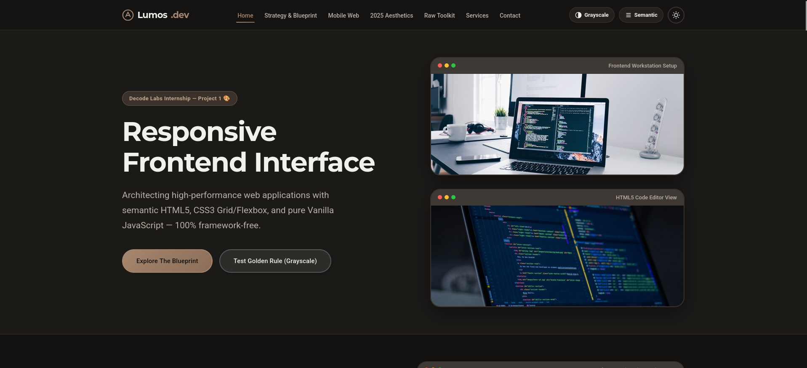

# Lumos — Responsive Frontend Interface

A fully responsive, mobile-first frontend interface built with **HTML5**, **CSS3**, and **Vanilla JavaScript**. No frameworks, no libraries — just clean, semantic, and accessible code.

## Screenshot



## Features

- **Fully Responsive** — Works perfectly on mobile (320px), tablet (768px), laptop (1024px), and desktop (1440px+)
- **Semantic HTML5** — Proper landmarks, heading hierarchy, and meaningful structure
- **Modern CSS** — CSS Grid, Flexbox, CSS variables, Clamp(), media queries
- **Vanilla JavaScript** — No frameworks, no jQuery, no dependencies
- **Accessible** — WCAG 2.1 AA compliant: keyboard navigation, ARIA labels, visible focus states, sufficient contrast
- **SEO-Friendly** — Meta tags, semantic structure, proper heading hierarchy
- **Theme Toggle** — Light/dark mode with localStorage persistence
- **Smooth Interactions** — Hamburger menu, smooth scrolling, scroll-to-top, form validation

## Project Structure

```
project1/
├── index.html
├── css/
│   ├── reset.css
│   ├── variables.css
│   ├── layout.css
│   ├── components.css
│   ├── utilities.css
│   └── responsive.css
├── js/
│   ├── main.js
│   ├── navigation.js
│   ├── validation.js
│   └── utilities.js
├── assets/
│   ├── images/
│   │   ├── screenshot.png
│   │   ├── hero.webp
│   │   ├── hero-bg.webp
│   │   ├── about.webp
│   │   ├── stats-bg.webp
│   │   └── team/
│   ├── icons/
│   └── fonts/
└── README.md
```

## Getting Started

Open `index.html` in a browser — no build step or server required.

## Tech Stack

- HTML5
- CSS3 (CSS Variables, Grid, Flexbox, Clamp, Media Queries)
- Vanilla JavaScript (ES Modules)
- Google Fonts (Inter + Roboto)

## Design Tokens

| Token       | Value    |
|-------------|----------|
| Primary     | `#A5866F`|
| Secondary   | `#A0D4E0`|
| Neutral BG  | `#F2F0EA`|
| Text        | `#3A3632`|
| Max Width   | 1200px   |
| Spacing     | 8px base |

## Accessibility

- Keyboard navigable
- Visible focus states
- ARIA labels on interactive elements
- Semantic heading hierarchy (h1 → h2 → h3)
- Screen reader–only text utility (`.sr-only`)
- `prefers-reduced-motion` respected

## License

MIT