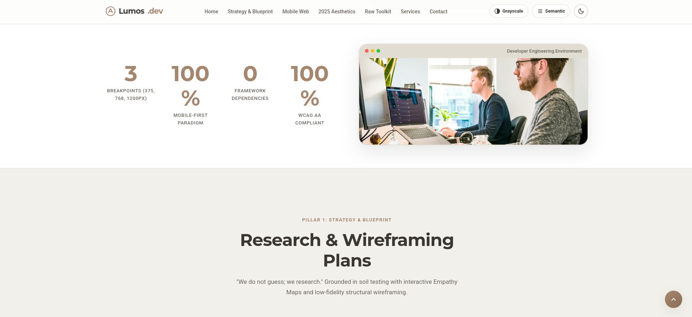
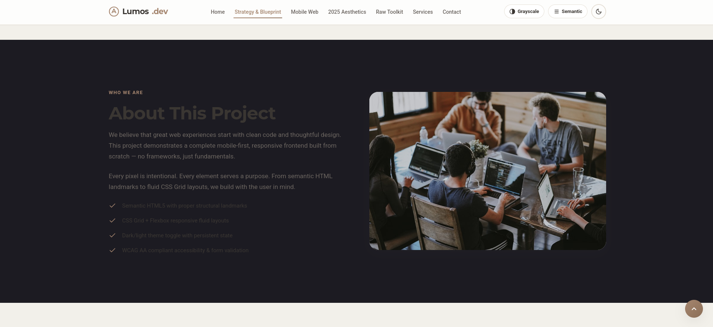
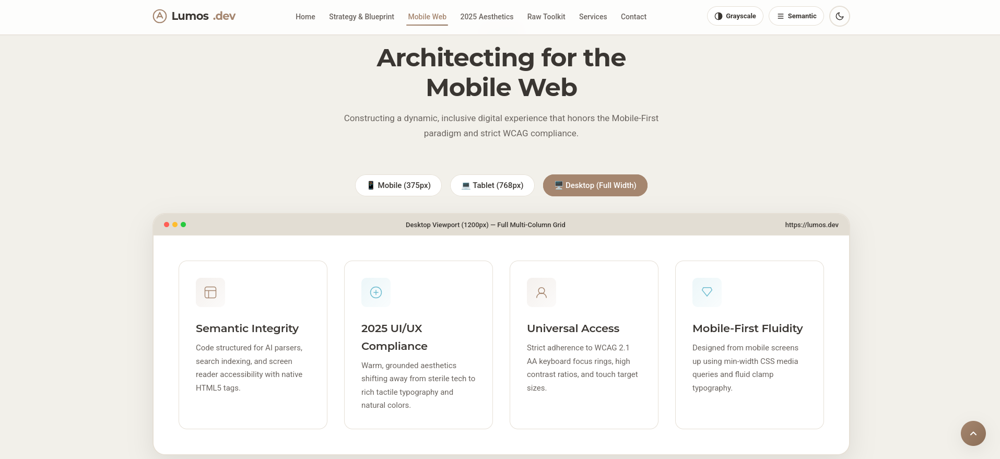
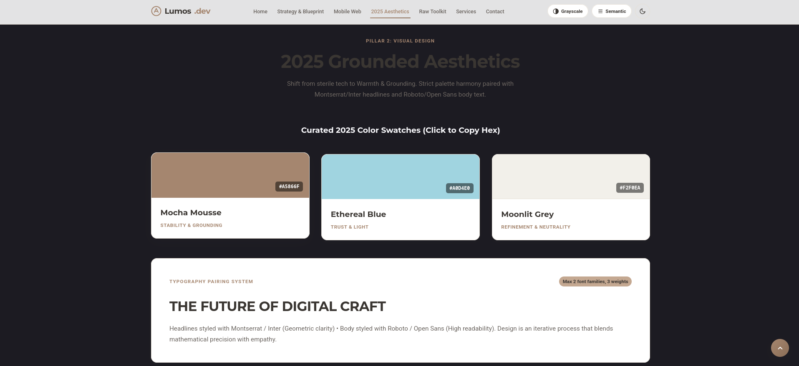
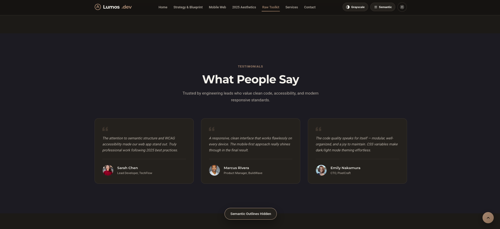
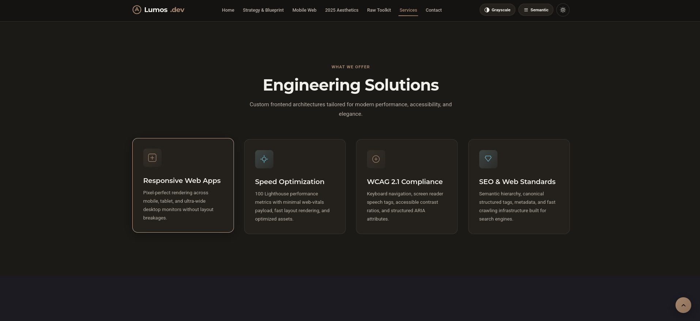
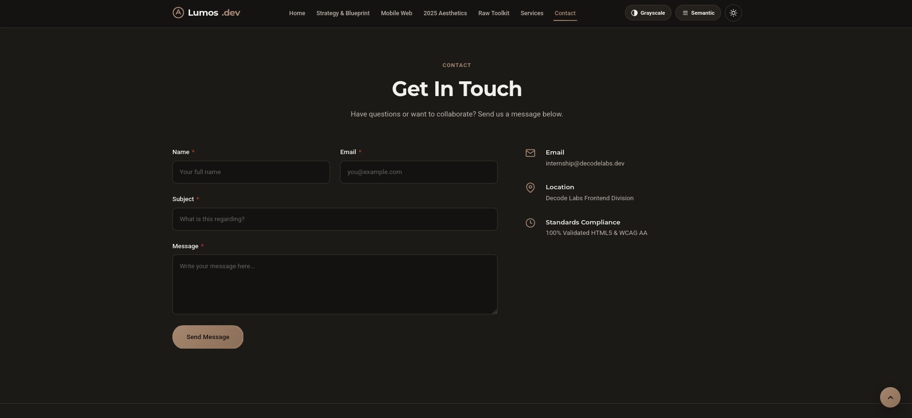

<div align="center">

# Lumos — Responsive Frontend Interface

[](https://developer.mozilla.org/en-US/docs/Web/HTML)
[](https://developer.mozilla.org/en-US/docs/Web/CSS)
[](https://developer.mozilla.org/en-US/docs/Web/JavaScript)
[](https://www.w3.org/WAI/standards-guidelines/wcag/)
[](https://github.com/GoharAbbas2122804/decodelabs_project1_GoharAbbas)

<p>A fully responsive, mobile-first frontend interface built with <b>HTML5</b>, <b>CSS3</b>, and <b>Vanilla JavaScript</b>. Mastered strictly through core web standards — 100% framework-free, lightweight, semantic, and accessible.</p>

---

### ↕️ Quick Navigation — Click to Jump to Any Image
<p align="center">
  <a href="#1-hero-section"><b>🖼️ Hero Section</b></a> •
  <a href="#2-strategy--research-blueprint"><b>🧠 Research & Strategy</b></a> •
  <a href="#3-about-this-project"><b>ℹ️ About Project</b></a> •
  <a href="#4-mobile-web-architecture"><b>📱 Mobile Web</b></a> <br>
  <a href="#5-2025-aesthetics--design-system"><b>🎨 2025 Aesthetics</b></a> •
  <a href="#6-testimonials"><b>💬 Testimonials</b></a> •
  <a href="#7-engineering-solutions"><b>⚙️ Solutions</b></a> •
  <a href="#8-contact-form--validation"><b>✉️ Contact Form</b></a>
</p>

</div>

---

## 🖼️ Quick Scroll Image Showcase

> **Tip:** Scroll through the grid below or click any thumbnail to jump directly to its detailed breakdown section.

<div align="center">
<table>
  <tr>
    <td align="center" width="50%">
      <b>1. Hero Section</b><br>
      <a href="#1-hero-section">
        
      </a>
    </td>
    <td align="center" width="50%">
      <b>2. Strategy & Research</b><br>
      <a href="#2-strategy--research-blueprint">
        
      </a>
    </td>
  </tr>
  <tr>
    <td align="center" width="50%">
      <b>3. About This Project</b><br>
      <a href="#3-about-this-project">
        
      </a>
    </td>
    <td align="center" width="50%">
      <b>4. Mobile Architecture</b><br>
      <a href="#4-mobile-web-architecture">
        
      </a>
    </td>
  </tr>
  <tr>
    <td align="center" width="50%">
      <b>5. 2025 Aesthetics</b><br>
      <a href="#5-2025-aesthetics--design-system">
        
      </a>
    </td>
    <td align="center" width="50%">
      <b>6. Testimonials</b><br>
      <a href="#6-testimonials">
        
      </a>
    </td>
  </tr>
  <tr>
    <td align="center" width="50%">
      <b>7. Engineering Solutions</b><br>
      <a href="#7-engineering-solutions">
        
      </a>
    </td>
    <td align="center" width="50%">
      <b>8. Contact Form & Validation</b><br>
      <a href="#8-contact-form--validation">
        
      </a>
    </td>
  </tr>
</table>
</div>

---

## 📸 Full High-Resolution Interface Walkthrough

### 1. Hero Section
The landing hero section features a clean brand identity (`Lumos.dev`), primary action call-to-actions, and an interactive developer workstation showcase card.
<p align="center">
  
</p>

---

### 2. Strategy & Research Blueprint
Grounded in user empathy research, featuring an interactive **Empathy Map** (Says, Thinks, Does, Feels) and the **Golden Rule Grayscale Toggle** (*"If it doesn't work in grayscale, color won't fix it"*).
<p align="center">
  
</p>

---

### 3. About This Project
Detailed overview of the project engineering philosophy, highlighting fundamental HTML5 semantic landmarks, CSS Grid responsiveness, persistent light/dark themes, and WCAG AA accessibility.
<p align="center">
  
</p>

---

### 4. Mobile Web Architecture
An interactive **Viewport Simulator** that demonstrates multi-column fluid layouts adapting across Mobile (375px), Tablet (768px), and Desktop (1200px+).
<p align="center">
  
</p>

---

### 5. 2025 Aesthetics & Design System
Showcases a grounded 2025 color palette (Mocha Mousse `#A5866F`, Ethereal Blue `#A0D4E0`, Moonlit Grey `#F2F0EA`) with click-to-copy hex swatches and a maximum 2-family typography system (Montserrat/Inter & Roboto/Open Sans).
<p align="center">
  
</p>

---

### 6. Testimonials
A responsive grid of client testimonials with high-contrast blockquotes, author avatars, and engineering lead reviews.
<p align="center">
  
</p>

---

### 7. Engineering Solutions
Highlighting core services including Responsive Web Apps, Speed Optimization, WCAG 2.1 Compliance, and SEO Web Standards.
<p align="center">
  
</p>

---

### 8. Contact Form & Validation
An accessible contact form with real-time field validation, ARIA live region error messages, and success status indicators.
<p align="center">
  
</p>

---

## ⚡ Key Features

- **Mobile-First Responsive Design** — Fluid scaling across Mobile (320px+), Tablet (768px), Laptop (1024px), and Ultra-wide Desktop (1440px+).
- **Zero Framework Mandate** — Built entirely with native HTML5, CSS3, and ES Module Vanilla JavaScript.
- **Interactive Inspection Tools**:
  - **Grayscale Toggle**: Test color-independent visual hierarchy.
  - **Semantic Outline Toggle**: Inspect HTML5 structural landmark boundaries.
  - **Viewport Simulator**: Test device layouts live on-screen.
  - **Empathy Quadrant Switcher**: Explore interactive strategy cards.
- **2025 Aesthetics** — Grounded color swatches (`#A5866F`, `#A0D4E0`, `#F2F0EA`), subtle glassmorphism, smooth animations.
- **Light/Dark Mode Theme Switcher** — Smooth CSS variable transitions with `localStorage` persistence.
- **WCAG 2.1 AA Accessible** — Keyboard navigation, visible focus indicators, screen-reader friendly ARIA attributes (`aria-expanded`, `aria-live`, `aria-checked`).
- **Real-Time Form Validation** — Accessible client-side validation with dynamic error states.

---

## 📁 Project Structure

```
project1/
├── index.html
├── css/
│   ├── reset.css
│   ├── variables.css
│   ├── layout.css
│   ├── components.css
│   ├── utilities.css
│   └── responsive.css
├── js/
│   ├── main.js
│   ├── navigation.js
│   ├── validation.js
│   ├── interactive-features.js
│   └── utilities.js
├── assets/
│   ├── images/
│   │   ├── screenshot.png          # Hero section
│   │   ├── research.png            # Strategy & Research
│   │   ├── about_this_project.png  # About section
│   │   ├── architecture.png        # Mobile Web Architecture
│   │   ├── aesthetics.png          # 2025 Aesthetics
│   │   ├── testimonials.png        # Testimonials section
│   │   ├── solutions.png           # Engineering Solutions
│   │   └── contact_form.png        # Contact Form
│   ├── icons/
│   └── fonts/
└── README.md
```

---

## 🛠️ Tech Stack

- **HTML5**: Semantic landmarks (`<header>`, `<nav>`, `<main>`, `<section>`, `<article>`, `<aside>`, `<footer>`)
- **CSS3**: Custom Properties (CSS Variables), Grid, Flexbox, `clamp()` math, Media Queries
- **Vanilla JavaScript**: ES Modules, DOM API, `localStorage`, Event Delegation
- **Typography**: Google Fonts (Montserrat, Inter, Roboto, Open Sans)

---

## 🎨 Design System & Color Tokens

| Token Name    | Hex Code  | Role / Purpose                 |
|---------------|-----------|--------------------------------|
| Mocha Mousse  | `#A5866F` | Primary Brand & Grounding      |
| Ethereal Blue | `#A0D4E0` | Secondary Accent & Highlight   |
| Moonlit Grey  | `#F2F0EA` | Neutral Background & Cards     |
| Text Dark     | `#3A3632` | High-contrast Readable Content |

---

## 🚀 Getting Started

No build step or node package manager required. Simply open `index.html` in any modern web browser or serve via Live Server.

---

## ♿ Accessibility Standards

- **Keyboard Navigable**: All interactive controls, dialogs, and tools are accessible via `Tab` and `Enter/Space`.
- **Visible Focus Rings**: Custom, high-contrast focus outlines for enhanced visibility.
- **Screen Reader Optimized**: Proper ARIA landmarks, `sr-only` utility classes, and dynamic live status regions.
- **Motion Sensitivity**: Honors user system preferences for reduced motion via `@media (prefers-reduced-motion: reduce)`.

---

## 📄 License

MIT License